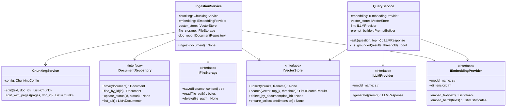

# System Design — RAG Q&A Bot

> **Dự án:** Chatbot hỏi đáp tài liệu pháp lý (Nghị định xử phạt)
> **Tác giả:** Thực tập sinh
> **Tuần:** 1 — Phân tích & Thiết kế hệ thống

---

## 1. Bài Toán

**Input:** Người dùng upload file PDF nghị định xử phạt vi phạm hành chính.
**Output:** Hệ thống trả lời câu hỏi pháp lý dựa đúng trên nội dung file đó, kèm trích dẫn nguồn (trang, đoạn).

**Vấn đề cốt lõi cần giải quyết:**
- LLM có thể "bịa" (hallucination) → cần cơ chế grounding
- File PDF lớn không thể nhét hết vào prompt → cần RAG (Retrieval-Augmented Generation)
- Upload file lớn không được block request → cần xử lý bất đồng bộ

---

## 2. Kiến Trúc Tổng Quan

```
┌─────────────┐     ┌──────────────────────────────────────────┐
│   CLIENT    │     │              FastAPI Application          │
│  (Browser / │────▶│  POST /upload  │  POST /ask  │  GET /status│
│   Postman)  │     └──────┬─────────┴──────┬──────┴────────────┘
└─────────────┘            │                │
                           ▼                ▼
                    ┌─────────────┐  ┌─────────────────┐
                    │   Celery    │  │  Query Service  │
                    │   Worker   │  │  (RAG Pipeline) │
                    └──────┬──────┘  └────────┬────────┘
                           │                  │
              ┌────────────┼──────────────────┼────────────┐
              ▼            ▼                  ▼            ▼
        ┌──────────┐ ┌──────────┐     ┌──────────┐ ┌──────────┐
        │PostgreSQL│ │  Qdrant  │     │  OpenAI  │ │  Redis   │
        │(metadata)│ │(vectors) │     │   API    │ │(broker)  │
        └──────────┘ └──────────┘     └──────────┘ └──────────┘
```

---

## 3. Tech Stack & Lý Do Chọn

| Thành phần | Công nghệ | Lý do |
|---|---|---|
| API Framework | **FastAPI** | Async-native, auto Swagger docs, type hints |
| Embedding | **OpenAI text-embedding-3-small** | Multilingual tốt, giá rẻ ($0.02/1M tokens) |
| LLM | **Anthropic Claude 3.5 Haiku** | Tiếng Việt tốt, instruction-following mạnh |
| Vector DB | **Qdrant** | Dễ setup Docker, filter metadata mạnh |
| Relational DB | **PostgreSQL** | Lưu metadata tài liệu, job status |
| Task Queue | **Celery + Redis** | Xử lý async upload, có retry, monitoring |
| File Parsing | **pypdf + unstructured** | pypdf cho PDF text, unstructured cho PDF scan |
| Containerization | **Docker Compose** | Reproducible environment |

---

## 4. Luồng Xử Lý Chính

### 4.1 Luồng Upload & Ingest (Bất đồng bộ)

```
User upload PDF
      │
      ▼
POST /documents/upload
      │
      ├─ Lưu file vào disk
      ├─ Tạo Document record (status=PENDING)
      ├─ Đẩy task vào Celery queue
      └─ Trả về 202 Accepted + document_id (ngay lập tức)

[Celery Worker chạy nền]
      │
      ├─ PdfParser.parse_with_pages() → text theo từng trang
      ├─ ChunkingService.split() → List[Chunk] (512 tokens/chunk)
      ├─ OpenAIEmbeddingProvider.embed_batch() → List[vector]
      ├─ QdrantVectorStore.upsert() → lưu vectors
      └─ Document.status = COMPLETED

User polling: GET /documents/{id}/status
```

### 4.2 Luồng Q&A (Đồng bộ)

```
User gửi câu hỏi
      │
      ▼
POST /ask {"question": "Mức phạt vi phạm tốc độ?"}
      │
      ├─ embed_text(question) → query_vector
      ├─ Qdrant.search(query_vector, top_k=5) → List[SearchResult]
      │
      ├─ [Nếu không tìm thấy context phù hợp]
      │   └─ Trả về: "Không tìm thấy trong tài liệu" (is_grounded=false)
      │
      └─ [Nếu có context]
          ├─ PromptBuilder.build_rag_prompt(question, results)
          ├─ LLM.generate(prompt) → answer
          └─ Trả về: answer + citations (is_grounded=true)
```

---

## 5. Class Diagram



---

## 6. Folder Structure (Clean Architecture)

```
src/
├── api/                    # Presentation Layer
│   ├── routers/            # FastAPI route handlers
│   ├── schemas/            # Pydantic request/response models
│   ├── dependencies.py     # DI container
│   └── main.py             # App factory
│
├── core/                   # Domain Layer (không phụ thuộc infra)
│   ├── entities/           # Pure Python domain objects
│   ├── interfaces/         # Abstract contracts (ABC)
│   └── services/           # Business logic (orchestration)
│
├── infrastructure/         # Infrastructure Layer
│   ├── database/           # PostgreSQL + SQLAlchemy
│   ├── embedding/          # OpenAI embedding
│   ├── llm/                # Anthropic/OpenAI/Ollama
│   ├── vector_store/       # Qdrant
│   ├── file_storage/       # Local disk
│   └── parsers/            # PDF parsing
│
└── workers/                # Async Task Layer
    ├── celery_app.py
    └── tasks/
        └── ingest_task.py
```

**Nguyên tắc:** Dependency Rule — mọi import chỉ đi từ ngoài vào trong (API → Core ← Infra). Core không bao giờ import Infrastructure.

---

## 7. Cấu Trúc Database

### Bảng `documents`

| Cột | Kiểu | Mô tả |
|---|---|---|
| `id` | UUID | Primary key |
| `filename` | VARCHAR(512) | Tên file gốc |
| `file_path` | VARCHAR(1024) | Đường dẫn lưu trữ |
| `status` | VARCHAR(32) | pending / processing / completed / failed |
| `chunk_count` | INTEGER | Số đoạn sau khi chunk |
| `file_size_bytes` | INTEGER | Kích thước file |
| `error_message` | TEXT | Lỗi nếu failed |
| `created_at` | DATETIME | Thời điểm upload |
| `updated_at` | DATETIME | Lần cập nhật cuối |

### Qdrant Collection `legal_docs`

Mỗi vector point chứa:
```json
{
  "id": "chunk-uuid",
  "vector": [0.12, -0.34, ...],  // 1536 chiều
  "payload": {
    "document_id": "doc-uuid",
    "filename": "nghi-dinh-100.pdf",
    "content": "Điều 5. Mức phạt...",
    "chunk_index": 3,
    "page_number": 12
  }
}
```

---

## 8. Definition of Done

- [x] Hỏi đúng nội dung tài liệu → có trích dẫn (filename, page, excerpt)
- [x] Từ chối trả lời khi context không đủ (`is_grounded=false`)
- [x] Upload không block request (202 Accepted + Celery async)
- [x] Dễ đổi LLM/Vector DB (interface-based, swap qua env var)
- [x] Benchmark được chunking strategies khác nhau
